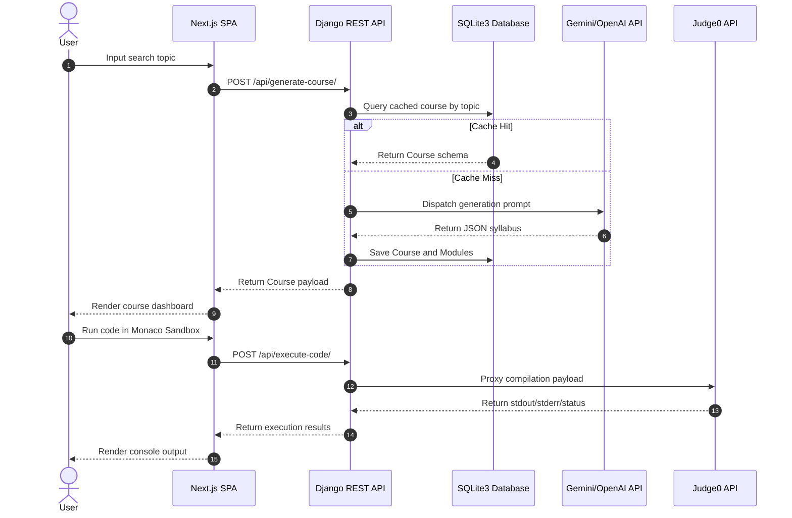
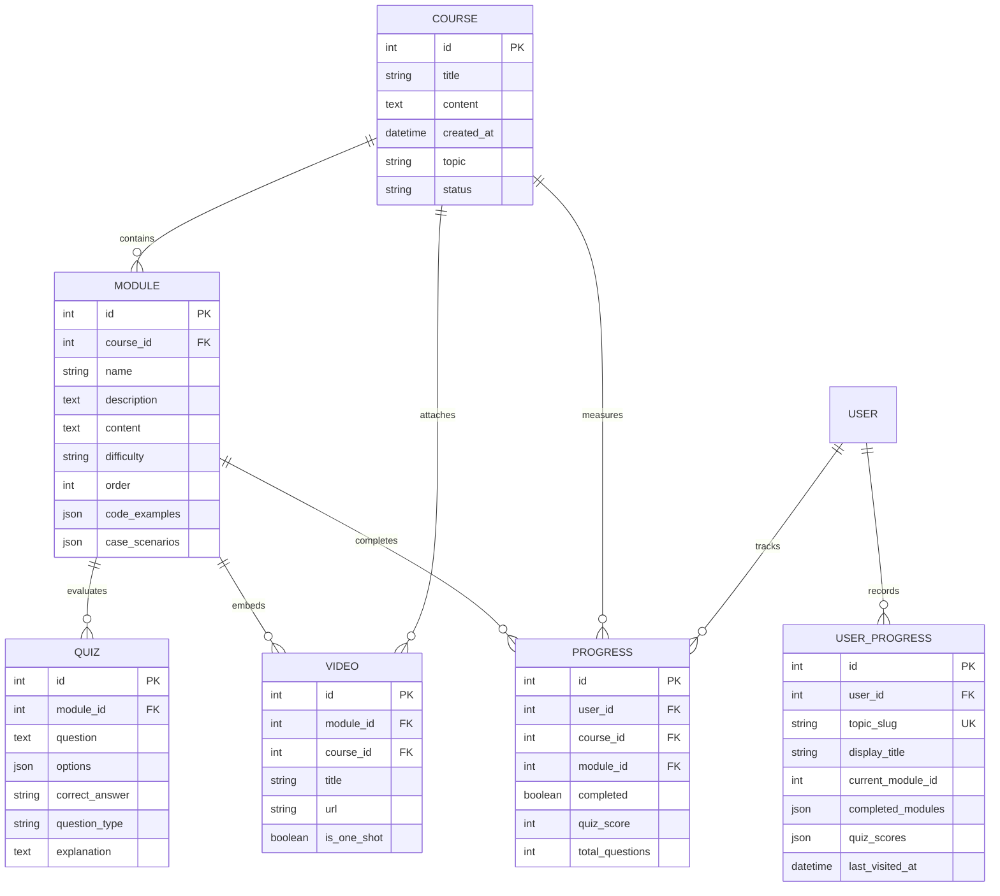

# MentAI - AI-Powered Interactive Learning Platform

MentAI is a production-grade educational platform that dynamically builds structured, university-grade course syllabi and lessons using generative AI. It features an in-browser Monaco Editor code-compiling laboratory (integrated with the Judge0 engine), a local SQLite3 database caching layer to minimize API latency and rate-limiting, progress and grade tracking, and high-fidelity PDF syllabus generators.

---

## Project Overview

MentAI addresses the problem of rigid, static learning curricula by generating personalized, highly relevant lesson paths customized to any conceptual query. The platform targets software engineering students and self-directed learners who require immediate theory coupled with sandboxed validation. 

By utilizing dynamic LLM prompting and local caching layers, the platform delivers structural theories, External Practice Problems (such as LeetCode/HackerRank templates), Practical Projects, and Self-Evaluation Quizzes in under 15ms for cached courses, while maintaining a fully executable coding environment.

---

## Feature Overview

### Frontend
- **Dynamic Lesson Viewer**: Clean, minimalistic UI built on a solid white surface with a signature Electric Cyan border accent.
- **Monaco Code Sandbox**: Embedded Monaco Editor workspace supporting real-time compilation and execution feedback.
- **Progress Tracking Navigation**: Sidebar Navigation component tracking quiz grades and lesson completions dynamically.
- **Interactive Quiz Interface**: Clean MCQ choice layout featuring circular letter indicators, hover translations, and real-time score evaluations.
- **Bug Hunter Debugging Game**: A specialized speed-run debugging mini-game embedded in the course loading overlay to maintain high user engagement during asynchronous AI generation.
- **PDF Exporter**: In-browser PDF generation engine converting course syllabi and quiz performance statistics into structured, page-break-safe PDF documents.

### Backend
- **Topic Classification Service**: Classifies incoming search queries into language categories to determine compiler execution runtimes.
- **Offline Material Libraries**: Built-in fallback database libraries for core subjects (such as SQL and MongoDB) to guarantee continuous availability when external rate-limits are reached.
- **Judge0 Proxy API**: Proxy handler managing secure, CORS-compliant client execution payloads dispatched to the remote Judge0 compiler API.
- **Progress Tracking & Sync Services**: Platform APIs maintaining user profiles, course state completions, and module quiz histories.

### AI Systems
- **Generative Syllabus Planner**: Prompts Gemini or OpenAI models to construct full 10-module curricula with distinct lessons, lab templates, quizzes, and project lists.
- **Syllabus Hydration Pipeline**: Formats and parses structured JSON syllabus returns to ensure field completeness.

### Database & Caching
- **SQLite3 Local Database**: Relational schema storing generated courses, lessons, and user profiles.
- **Instance Caching**: Intercepts requests to check for pre-generated courses before executing external AI calls.

### Infrastructure
- **Vercel Deployments**: Client-side single-page app static hosting.
- **Render Web Services**: Containerized server environment for the Python Django backend.

---

## Architecture

MentAI uses a decoupled client-server architecture. The frontend SPA communicates with the Django REST API, which acts as the core orchestrator, querying local databases, proxying compiled code, and routing prompts to generative AI gateways.

### System Interaction Diagram



### Database Schema Model (Entity-Relationship Diagram)



---

## Technology Stack

### Frontend
- **Core Library**: React (v18)
- **Framework**: Next.js (v14/v16 Pages router layout)
- **Code Editor Component**: `@monaco-editor/react` (Monaco Editor Integration)
- **Styling Framework**: Tailwind CSS (v3)
- **Animation Engine**: Framer Motion
- **HTTP Client**: Axios (v1)
- **PDF Generation**: `jspdf`

### Backend
- **Framework**: Django (v5)
- **REST Toolkit**: Django REST Framework (DRF)
- **WSGI Server**: Gunicorn (v23)
- **Static Assets Handler**: Whitenoise (v6)

### Database
- **Engine**: SQLite3
- **Database URL Parser**: `dj-database_url`

### AI Integrations
- **SDK**: `google-generativeai` (Legacy Python Gemini API wrapper)
- **AI Models**: Gemini (API Key configured via environment variables)

### Development Tooling
- **Python Manager**: `venv` (Virtualenv)
- **Node Package Manager**: `npm`

---

## System Design

### 1. Request Lifecycle
When a client requests a course path:
1. The request is intercepted by the Next.js Axios client wrapper which injects appropriate production environment API URLs.
2. The Django server routes the payload to `GenerateCourseView`.
3. The view sanitizes the topic query by converting it to lowercase and stripping whitespace.
4. It performs an initial indexed query on the `Course` database table.
5. If cached, the serialized data is compiled and returned in `< 15ms`.
6. If uncached, it delegates processing to the `AICourseOrchestrator` service, running asynchronous API calls to prompt external models. The resulting structure is saved to the database before rendering, preventing duplicate generations.

### 2. Connection Pool Management (PostgreSQL Render Stability)
To survive Render's strict database connection limits, the Django application database configuration utilizes:
- `conn_max_age = 0`: Instructs Django to close connections immediately at the end of each HTTP request, releasing them back to the server pool to avoid `OperationalError: SSL connection has been closed unexpectedly`.
- `conn_health_checks = True`: Instructs the database wrapper to perform a health check on the connection prior to query execution. If a connection drop is identified, it re-establishes a fresh socket seamlessly.

---

## API Documentation

### 1. Generate Course
- **Route**: `POST /api/generate-course/`
- **Purpose**: Checks local cache or triggers generative AI syllabus compilation for a given topic.
- **Request Structure**:
  ```json
  {
    "topic": "Python Programming",
    "email": "user@example.com",
    "force": false
  }
  ```
- **Response Structure (200 OK)**:
  ```json
  {
    "id": 12,
    "title": "Python Programming Mastery",
    "content": "Full structural course covering standard language features.",
    "topic": "python programming",
    "modules": [
      {
        "id": 45,
        "name": "Module 1: Syntax Basics",
        "description": "Introduction to variables, types, and operations.",
        "theory": "# Syntax Fundamentals...",
        "mini_labs": [
          {
            "title": "Lab 1: Variable Assigning",
            "description": "Practice declaring variables and basic arithmetic.",
            "preloaded_code": "a = 5\nb = 10\nprint(a + b)"
          }
        ],
        "quizzes": [
          {
            "id": 23,
            "question": "What is the correct syntax to declare a function in Python?",
            "options": ["def my_func():", "function myFunc()", "func my_func()"],
            "correct_answer": "def my_func():",
            "explanation": "In Python, functions are declared using the 'def' keyword."
          }
        ]
      }
    ]
  }
  ```

### 2. Code Execution Proxy
- **Route**: `POST /api/execute-code/`
- **Purpose**: Proxies client code snippets to the Judge0 compiler engine and returns stdout/stderr.
- **Request Structure**:
  ```json
  {
    "code": "print('Hello World')",
    "language": "python",
    "topic": "python"
  }
  ```
- **Response Structure (200 OK)**:
  ```json
  {
    "stdout": "Hello World\n",
    "stderr": "",
    "compile_output": "",
    "status": {
      "id": 3,
      "description": "Accepted"
    }
  }
  ```

### 3. Progress Sync
- **Route**: `POST /api/progress/update/`
- **Purpose**: Synchronizes student learning state and quiz scores.
- **Request Structure**:
  ```json
  {
    "email": "user@example.com",
    "topic_slug": "python",
    "module_id": 1,
    "is_completed": true,
    "quiz_score": 90
  }
  ```
- **Response Structure (200 OK)**:
  ```json
  {
    "status": "success",
    "message": "Progress synchronized successfully."
  }
  ```

---

## Frontend Documentation

The frontend is built using a modern **Pages Router** pattern inside Next.js.
- **State Management**: Governed locally using React hooks (`useState`, `useEffect`) and cached persistently inside `localStorage` to ensure navigation persistence across dynamic pages.
- **CORS Middleware Handling**: Implemented full `CORS_ALLOW_CREDENTIALS = True` and customizable `CORS_ALLOW_HEADERS` in `settings.py` to prevent browser flight checks from blocking remote requests.
- **Monaco Setup**: The code sandbox handles input synchronization inside `CodeEditor.tsx` using `useRef` binds and passes execution scopes to the compiler proxy views.

---

## Environment Variables

| Variable | Description | Required |
| :--- | :--- | :--- |
| `GEMINI_API_KEY` | API authentication key for Gemini generative AI courses. | Yes (in production) |
| `NEXT_PUBLIC_API_URL` | Frontend URL pointing to the deployed Django API endpoint. | Yes (frontend build) |
| `SECRET_KEY` | Django server-side secure hash signing token. | Yes (backend setup) |
| `DEBUG` | Dictates debug mode states (True in local, False in prod). | No (defaults to True) |

---

## Local Development Setup

### 1. Prerequisites
- **Python 3.10+**
- **Node.js 18+**

### 2. Backend Installation
1. Navigate to the backend directory:
   ```bash
   cd backend
   ```
2. Create and activate a Python virtual environment:
   ```bash
   python3 -m venv venv
   source venv/bin/activate
   ```
3. Install Python dependencies:
   ```bash
   pip install -r requirements.txt
   ```
4. Perform SQLite3 migrations:
   ```bash
   python manage.py migrate
   ```
5. Run the local backend web server:
   ```bash
   python manage.py runserver 0.0.0.0:8000
   ```

### 3. Frontend Installation
1. Navigate to the frontend directory:
   ```bash
   cd ../frontend
   ```
2. Install npm packages:
   ```bash
   npm install
   ```
3. Run the local development server:
   ```bash
   npm run dev
   ```
4. Access the client interface at `http://localhost:3000`.

---

## Testing

MentAI includes automated verification scripts to validate database configurations and compiler proxy endpoints.

- **Running the Compiler Test**:
  ```bash
  python backend/test_compiler.py
  ```
  *Validates successful Judge0 executions for Python, Java, JavaScript, Rust, and C++.*

- **Running the Cache Test**:
  ```bash
  python backend/test_sql_cache.py
  ```
  *Validates local cache hits, database queries, and retrieval latency checks under 15ms.*

---

## Known Limitations

- **Free Tier Cold Starts**: Render's free tier spins down web services after 15 minutes of inactivity, causing initial course generation requests to delay up to 50 seconds while the server boots.
- **Judge0 Execution Limitations**: Code compilation relies on the public Judge0 API proxy. High traffic loads or rate limits may delay execution outputs inside Monaco Sandboxes.

---

## Future Improvements

- **PostgreSQL Connection Pooling**: Transitioning to server-side connection poolers (such as PgBouncer) to sustain highly scalable connection counts.
- **Standardized OAuth Integrations**: Transitioning progress APIs to secure session JWT tokens inside REST views.

---
